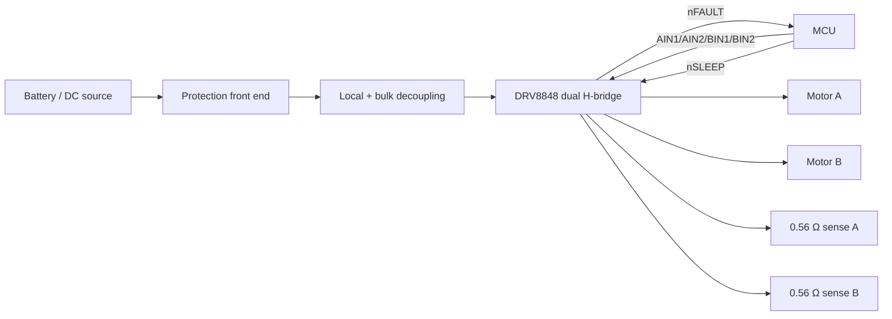

# Custom PCB Motor Driver

[](https://github.com/VivekVRobo/custom-pcb-motor-driver/actions/workflows/checks.yml)

An evidence-driven reference design for a compact **dual brushed-DC motor driver** for mobile robotics, combining electrical decisions, tolerance-aware calculations, BOM traceability, KiCad capture scaffolds, PCB/thermal rules, staged validation gates, and automated engineering checks.

> **Status:** engineering reference with **KiCad capture in progress**, not a fabricated or bench-validated PCB. The electrical architecture, reference calculations and CAD handoff files are defined; verified schematic capture, footprint review, ERC/DRC, routing, fabrication and measured load/thermal results remain required before this can be called CAD-ready or hardware-validated.

## Project snapshot

| | |
|---|---|
| **Reference device** | TI DRV8848 dual H-bridge |
| **Target use** | Compact mobile-robot DC motor control |
| **Engineering model** | Current-limit tolerance, conduction loss, thermal screening, decoupling and interface checks |
| **Traceability** | Machine-readable design values, BOM, connectivity contract, KiCad capture sources, reference profile and validation gates |
| **Current maturity** | Engineering reference + CAD capture scaffold; no ERC/DRC/fabricated-board claim |
| **Next proof milestone** | Complete/verify schematic + footprints in KiCad, pass ERC, finish PCB placement/routing and pass DRC before fabrication outputs |

## Why this repository is different

Instead of presenting a generated schematic or board file as a “finished PCB,” this repository separates **design intent**, **CAD capture**, **CAD readiness**, **fabrication readiness**, and **measured hardware validation**. Critical assumptions live in YAML/CSV and are checked by code rather than being buried only in prose.

The repository includes:

- DRV8848 reference profile with datasheet provenance
- tolerance-aware current-limit calculations
- conduction-loss and rough thermal screening
- traceable engineering BOM with critical-component state
- machine-readable schematic connectivity contract
- KiCad project, schematic-capture scaffold and PCB net/outline scaffold
- documented electrical interfaces and safe states
- test-point plan for first-article validation
- PCB layout and PowerPAD/thermal guidance
- staged `reference` → `cad-ready` → `fab-ready` → `hardware-validated` release gates
- BOM, netlist and KiCad-source scaffold linters
- generated Markdown/JSON engineering reports
- unit-tested calculation tools and CI
- bring-up, validation, FMEA and manufacturing-release documentation

## Reference design

| Item | Reference target |
|---|---|
| Motor driver | TI DRV8848PWPR |
| Motor channels | 2 brushed DC |
| Application VM | 6–12.6 V |
| Expected continuous load | 0.75 A/channel |
| Current regulation | 0.56 Ω sense resistor/channel, VREF tied to VINT |
| Nominal modeled current limit | ~0.893 A/channel |
| Modeled tolerance range | ~0.838–0.948 A/channel |
| PWM target | 20 kHz |
| VM local decoupling | 0.1 µF + 22 µF / 25 V |
| VINT bypass | 2.2 µF |
| Reference PCB | 2 layer, 2 oz copper, ground plane, exposed-pad thermal vias |

These are **reference design targets**, not measured specifications.

## Architecture



See [`docs/ARCHITECTURE.md`](docs/ARCHITECTURE.md), [`docs/ELECTRICAL_DESIGN.md`](docs/ELECTRICAL_DESIGN.md) and [`docs/REFERENCE_PROFILE_DRV8848.md`](docs/REFERENCE_PROFILE_DRV8848.md).

## Automated engineering checks

Install development dependencies and run:

```bash
python -m pip install -r requirements-dev.txt
pytest -q
python tools/design_check.py
python tools/bom_lint.py
python tools/netlist_lint.py
python tools/kicad_source_lint.py
python tools/generate_report.py
python tools/release_gate.py reference
```

Both of these gates are expected to fail today:

```bash
python tools/release_gate.py cad-ready
python tools/release_gate.py fab-ready
```

Those failures are intentional. They prevent the presence of generated KiCad source from being mistaken for verified footprints, ERC, DRC or Gerber review.

## Engineering model

The main sizing utility evaluates the reference YAML against the DRV8848 profile. It checks application voltage, PWM frequency, nominal and tolerance-aware current limits, sense-resistor loading, local decoupling, and a deliberately simple junction-temperature screen.

The thermal result uses datasheet θJA as a **screening calculation only**. Actual junction/board temperature depends on PCB copper, exposed-pad soldering, via construction, airflow, enclosure and operating waveform, so hardware thermal testing remains mandatory.

## Repository map

```text
.
├── .github/
│   ├── ISSUE_TEMPLATE/
│   ├── pull_request_template.md
│   └── workflows/checks.yml
├── docs/
│   ├── ARCHITECTURE.md
│   ├── BRINGUP.md
│   ├── DESIGN_REVIEW_CHECKLIST.md
│   ├── DESIGN_SPEC.md
│   ├── ELECTRICAL_DESIGN.md
│   ├── FAILURE_MODES.md
│   ├── MANUFACTURING_RELEASE.md
│   ├── PCB_LAYOUT_RULES.md
│   ├── REFERENCE_PROFILE_DRV8848.md
│   ├── THERMAL_DESIGN.md
│   └── VALIDATION_PLAN.md
├── examples/
│   └── motor_profile_small_gearmotor.yaml
├── hardware/
│   ├── BOM.csv
│   ├── design_values.yaml
│   ├── interfaces.csv
│   ├── test_points.csv
│   ├── cad/
│   │   ├── README.md
│   │   ├── netlist_spec.yaml
│   │   ├── custom_pcb_motor_driver.kicad_pro
│   │   ├── custom_pcb_motor_driver.kicad_sch
│   │   └── custom_pcb_motor_driver.kicad_pcb
│   └── reference_profiles/drv8848.yaml
├── tools/
│   ├── bom_lint.py
│   ├── current_estimator.py
│   ├── design_check.py
│   ├── design_model.py
│   ├── generate_report.py
│   ├── kicad_source_lint.py
│   ├── netlist_lint.py
│   └── release_gate.py
└── tests/
```

## Release truth table

| Stage | Current state |
|---|---|
| Engineering reference | ✅ |
| KiCad capture started | ✅ — native project/schematic/PCB scaffold committed |
| CAD ready | ❌ — completed schematic, verified footprints and real ERC evidence still missing |
| Fabrication ready | ❌ — PCB placement/routing, DRC and Gerber review missing |
| Fabricated | ❌ |
| Hardware validated | ❌ — no measured motor/thermal/stall data yet |

The source of truth is [`hardware/design_values.yaml`](hardware/design_values.yaml), and [`tools/release_gate.py`](tools/release_gate.py) enforces the evidence required for each stage.

## Key engineering decisions

**Current regulation.** The reference uses a 0.56 Ω sense resistor per channel with VREF tied to VINT. The connectivity contract models `U1.VINT`, `U1.VREF`, the VINT capacitor and exposed header reference as one physical rail. The model includes VINT and resistor tolerance rather than trusting only a nominal current-limit number.

**Thermal strategy.** The exposed pad, ground plane and thermal vias are part of the electrical design, not optional cosmetics. Rough thermal math is used to catch obviously bad choices early, then real hardware measurements must replace estimates.

**Protection stays application-specific.** Fuse, reverse-polarity device, TVS and optional bulk capacitance cannot be selected credibly without the final battery/source, cable/harness and motor transient behavior. The repo documents the architecture and review criteria instead of inventing part numbers.

**CAD honesty.** KiCad-native source now exists as an explicitly **unvalidated capture scaffold**. [`hardware/cad/netlist_spec.yaml`](hardware/cad/netlist_spec.yaml) remains the authoritative connectivity contract while real symbols, footprints, ERC/DRC and layout evidence are completed. The repository does not turn validation flags green merely because files were generated.

## Contributing

Contributions are welcome when they improve traceability, calculations, CAD evidence, validation, documentation, or test automation. Read [`CONTRIBUTING.md`](CONTRIBUTING.md) before opening a pull request.

Real hardware contributions should record board revision, supply, motor/load, instrumentation, ambient conditions and test method so results remain useful to others.

## Before ordering a PCB

Complete [`docs/DESIGN_REVIEW_CHECKLIST.md`](docs/DESIGN_REVIEW_CHECKLIST.md), finish and independently verify the real CAD files, run ERC/DRC, review fabrication outputs, and satisfy the `fab-ready` gate with actual evidence.

## First article

Follow [`docs/BRINGUP.md`](docs/BRINGUP.md) and [`docs/VALIDATION_PLAN.md`](docs/VALIDATION_PLAN.md). Start from current-limited power with no motors, verify VINT/nFAULT/nSLEEP, test each bridge separately, verify current regulation, then move to dual-channel load and thermal testing.

## Primary component sources

The reference profile is derived from Texas Instruments' DRV8848 product page and datasheet. Re-check the current datasheet revision and device lifecycle before a real procurement/fabrication release.

## License

MIT — see [`LICENSE`](LICENSE). Hardware documentation and calculations are provided without warranty; independently verify all electrical, thermal and safety assumptions for the actual application.
