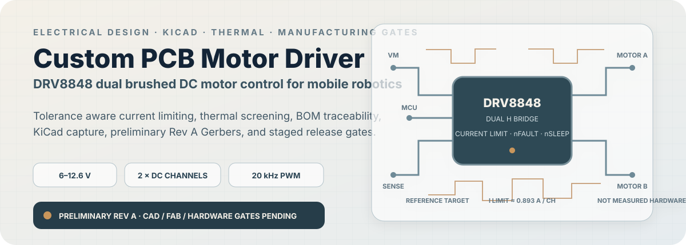
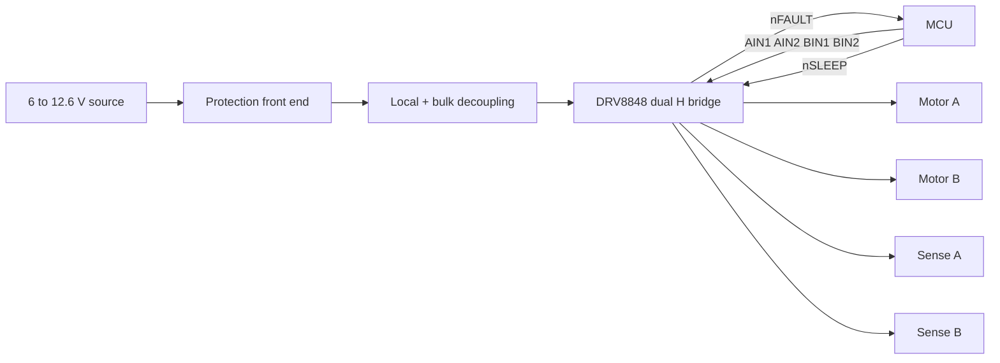

<p align="center">
  
</p>

<p align="center">
  <a href="https://github.com/VivekVRobo/custom-pcb-motor-driver/actions/workflows/checks.yml"></a>
  
  
  
  
</p>

<p align="center">
  <strong>A traceable dual brushed DC motor driver reference design that separates electrical intent, CAD capture, manufacturing release, fabrication, and measured hardware validation.</strong>
</p>

> [!IMPORTANT]
> **Current state:** preliminary Rev A KiCad sources and manufacturing outputs exist, but the board is **not fab ready and not hardware validated**. Recorded schematic review, footprint verification, ERC/DRC evidence, final manufacturing review, fabrication, assembly, and bench measurements remain required.

<p align="center">
  <a href="docs/ELECTRICAL_DESIGN.md"><strong>Electrical Design</strong></a> ·
  <a href="docs/PCB_LAYOUT_RULES.md"><strong>PCB Rules</strong></a> ·
  <a href="docs/THERMAL_DESIGN.md"><strong>Thermal</strong></a> ·
  <a href="docs/MANUFACTURING_RELEASE.md"><strong>Manufacturing Gate</strong></a> ·
  <a href="docs/VALIDATION_PLAN.md"><strong>Validation Plan</strong></a>
</p>

---

## Design State

| Stage | Evidence | Status |
| --- | --- | :---: |
| **Engineering reference** | Electrical model, requirements, design rules | ✅ |
| **Native KiCad sources** | Project, schematic, PCB files | ✅ Present |
| **BOM and traceability** | BOM, reference profile, design values | ✅ Present |
| **Preliminary Rev A outputs** | Gerbers, drill files, checksum, ordering notes | ✅ Candidate |
| **CAD review** | Schematic, footprints, ERC and DRC evidence | ◐ Pending |
| **Fabrication release** | Reviewed immutable manufacturing package | ◐ Pending |
| **Fabricated board** | Physical first article | ❌ No |
| **Bench power up** | Rail and fault measurements | ❌ No |
| **Motor load validation** | Current, drive, stall measurements | ❌ No |
| **Thermal validation** | Measured board temperature under documented load | ❌ No |

A generated Gerber archive is not treated as evidence that the board has passed fabrication review.

---

## Electrical Architecture


```mermaid
flowchart LR
    SRC[6 to 12.6 V source] --> P[Protection front end]
    P --> C[Local + bulk decoupling]
    C --> D[DRV8848 dual H bridge]

    MCU[MCU] -->|AIN1 AIN2 BIN1 BIN2| D
    MCU -->|nSLEEP| D
    D -->|nFAULT| MCU

    D --> A[Motor A]
    D --> B[Motor B]
    D --> SA[Sense A]
    D --> SB[Sense B]
```

The design target is a compact two channel brushed DC motor driver for mobile robotics.

---

## Reference Targets

| Item | Reference target |
| --- | --- |
| Driver | TI DRV8848PWPR |
| Channels | 2 brushed DC motors |
| VM range | 6 to 12.6 V |
| Logic voltage | 3.3 V |
| Expected continuous load | 0.75 A per channel |
| Sense resistor | 0.56 Ω per channel |
| Nominal modeled current limit | ~0.893 A per channel |
| Modeled tolerance range | ~0.838 to 0.948 A per channel |
| PWM target | 20 kHz |
| Local VM capacitance | 0.1 µF + 22 µF / 25 V |
| VINT bypass | 2.2 µF |
| Reference PCB | 2 layer, 2 oz copper |
| Power trace target | minimum 1.5 mm |
| Exposed pad thermal vias | 9 |

These are engineering targets from the design model, not measured hardware specifications.

---

## Why This Repository Exists

The project deliberately keeps these stages separate:

```text
design intent
    ↓
electrical modelling
    ↓
CAD capture
    ↓
CAD verification
    ↓
fabrication release
    ↓
physical bring up
    ↓
measured hardware validation
```

That prevents schematic files or manufacturing outputs from being presented as if a physical board had already passed bench testing.

---

## Engineering Decisions

### Current limiting

The reference uses a **0.56 Ω sense resistor per channel** and models component tolerance instead of relying only on a nominal current limit.

### Thermal strategy

The exposed PowerPAD, copper area, ground plane, and thermal vias are treated as functional electrical and thermal design elements.

Datasheet thermal values are used for screening only. Final temperature must be measured on real hardware.

### Protection

Fuse strategy, reverse polarity protection, TVS selection, and bulk capacitance remain application dependent because they depend on battery chemistry, harness inductance, and motor transient behavior.

### Evidence boundary

Calculations, CAD, and preliminary Gerbers stay separate from fabricated and measured hardware evidence.

---

## Automated Engineering Checks

Install development requirements and run:

```bash
python -m pip install -r requirements-dev.txt
pytest -q

python tools/design_check.py
python tools/bom_lint.py
python tools/netlist_lint.py
python tools/kicad_source_lint.py
python tools/generate_report.py
python tools/release_gate.py reference
```

Higher gates remain intentionally red until their required evidence exists:

```bash
python tools/release_gate.py cad-ready
python tools/release_gate.py fab-ready
```

A file existing in the repository is not enough to turn a release gate green.

---

## Preliminary Rev A Package

Candidate review artifacts include:

* [Fabrication specification](hardware/cad/FABRICATION_SPEC.md)
* [Ordering guide](hardware/cad/ORDERING_GUIDE.md)
* [Gerber and drill archive](hardware/cad/gerbers_drv8848_revA.zip)
* [Gerber checksum](hardware/cad/GERBERS_CHECKSUM.sha256)
* [BOM](hardware/BOM.csv)
* [Native KiCad project](hardware/cad/custom_pcb_motor_driver.kicad_pro)
* [Native schematic](hardware/cad/custom_pcb_motor_driver.kicad_sch)
* [Native PCB](hardware/cad/custom_pcb_motor_driver.kicad_pcb)

These are review artifacts, not a fabrication approval.

---

## First Article Validation Path

After CAD and manufacturing release gates genuinely pass:

1. inspect an unpopulated board for continuity and isolation
2. inspect assembly, polarity, exposed pad, and connector orientation
3. power up under a current limited supply
4. verify rails and logic behavior
5. measure drive and PWM waveforms
6. run controlled motor or resistive load sweeps
7. test current limiting and fault behavior
8. record temperature under a documented load and ambient condition
9. test stall behavior within a safe controlled setup

[**First article protocol →**](hardware/validation/2026-09-08_first_article_bringup_protocol.md)

---

## Repository Map

```text
hardware/
├── BOM.csv
├── design_values.yaml
├── interfaces.csv
├── test_points.csv
├── cad/
│   ├── custom_pcb_motor_driver.kicad_pro
│   ├── custom_pcb_motor_driver.kicad_sch
│   ├── custom_pcb_motor_driver.kicad_pcb
│   ├── FABRICATION_SPEC.md
│   ├── ORDERING_GUIDE.md
│   └── gerbers_drv8848_revA.zip
└── validation/

docs/
├── ELECTRICAL_DESIGN.md
├── PCB_LAYOUT_RULES.md
├── THERMAL_DESIGN.md
├── MANUFACTURING_RELEASE.md
├── FAILURE_MODES.md
└── VALIDATION_PLAN.md
```

---

## Current Proof Priority

The next meaningful milestone is not another generated document.

It is:

**complete the real CAD review → satisfy the fab ready gate → fabricate Rev A → assemble the board → publish measured electrical, load, fault, and thermal evidence.**

---

## Release Status

The first tag should remain an **engineering reference release**.

Allowed claims include documented electrical sizing, tolerance aware calculations, KiCad sources, BOM traceability, preliminary manufacturing outputs, automated checks, and a first article validation protocol.

Blocked claims include fab ready, fabricated, hardware validated, measured current limit, thermal performance, stall performance, or safety qualification until those gates actually pass.

[**Release readiness →**](docs/RELEASE_READINESS.md)

---

## License

MIT. See [`LICENSE`](LICENSE).

Independently verify electrical, thermal, manufacturing, and safety assumptions before using the design in real hardware.
