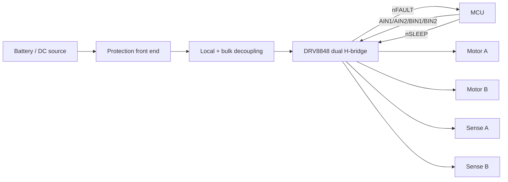

# Custom PCB Motor Driver

[](https://github.com/VivekVRobo/custom-pcb-motor-driver/actions/workflows/checks.yml)

A traceable reference design for a compact **dual brushed-DC motor driver** for mobile robotics based on the TI DRV8848. The repository combines electrical sizing, tolerance-aware calculations, KiCad sources, BOM traceability, PCB/thermal rules, staged validation gates, and automated engineering checks.

> **Current status:** engineering reference with a **preliminary Rev-A CAD/fabrication package generated, but not released as fabrication-ready hardware**. Native KiCad source, BOM, Gerbers and ordering documentation exist, but verified schematic/footprint review, recorded ERC/DRC evidence, final manufacturing review, fabrication, and bench measurements are still required before the board can be called `fab-ready` or `hardware-validated`.

## Recruiter quick scan

| Area | Current state |
| --- | --- |
| Motor driver | TI DRV8848 dual H-bridge |
| Target use | Compact mobile-robot DC motor control |
| Electrical model | Current-limit tolerance, conduction loss, thermal screening, decoupling and interface checks |
| CAD | KiCad project/schematic/PCB sources present |
| Manufacturing outputs | Preliminary Rev-A Gerber/drill archive and fabrication notes generated |
| Automated evidence | BOM/netlist/KiCad-source checks + unit-tested calculations + CI |
| Fabricated board | **No** |
| Bench validation | **No** |

## Why this project exists

The goal is not to present generated PCB files as finished hardware. The repository deliberately separates:

```text
design intent
    ↓
CAD capture
    ↓
CAD verification
    ↓
fabrication release
    ↓
physical bring-up
    ↓
measured hardware validation
```

That distinction matters because a schematic file or Gerber archive is not proof that a board has passed electrical review, DRC, fabrication, assembly, or load testing.

## Reference design targets

| Item | Reference target |
| --- | --- |
| Device | TI DRV8848PWPR |
| Channels | 2 brushed DC motors |
| Application VM | 6–12.6 V |
| Expected continuous load | 0.75 A/channel |
| Sense resistor | 0.56 Ω/channel |
| Nominal modeled current limit | ~0.893 A/channel |
| Modeled tolerance range | ~0.838–0.948 A/channel |
| PWM target | 20 kHz |
| VM local decoupling | 0.1 µF + 22 µF / 25 V |
| VINT bypass | 2.2 µF |
| Reference PCB | 2-layer, 2 oz copper, ground plane, exposed-pad thermal vias |

These values are **engineering targets**, not measured hardware specifications.

## Architecture


```mermaid
flowchart LR
    SRC[Battery / DC source] --> P[Protection front end]
    P --> C[Local + bulk decoupling]
    C --> D[DRV8848 dual H-bridge]
    MCU[MCU] -->|AIN1/AIN2/BIN1/BIN2| D
    MCU -->|nSLEEP| D
    D -->|nFAULT| MCU
    D --> A[Motor A]
    D --> B[Motor B]
    D --> SA[Sense A]
    D --> SB[Sense B]
```

## Automated checks

```bash
python -m pip install -r requirements-dev.txt
pytest -q
python tools/design_check.py
python tools/bom_lint.py
python tools/netlist_lint.py
python tools/kicad_source_lint.py
python tools/generate_report.py
python tools/release_gate.py reference
```

The higher release gates are intentionally evidence-driven. They should remain red until their required verification artifacts exist.

```bash
python tools/release_gate.py cad-ready
python tools/release_gate.py fab-ready
```

A generated file alone is not enough to turn either gate green.

## Release truth table

| Stage | Current state |
| --- | --- |
| Engineering reference | ✅ |
| Native KiCad sources present | ✅ |
| Preliminary manufacturing outputs generated | ✅ |
| CAD verified | ❌ recorded schematic/footprint/ERC/DRC review still required |
| Fabrication ready | ❌ final manufacturing-release review still required |
| Fabricated | ❌ |
| Hardware validated | ❌ no measured motor/current/thermal/stall data yet |

## Preliminary Rev-A manufacturing package

The repository contains a **candidate** Rev-A manufacturing package for review:

- [`hardware/cad/FABRICATION_SPEC.md`](hardware/cad/FABRICATION_SPEC.md)
- [`hardware/cad/ORDERING_GUIDE.md`](hardware/cad/ORDERING_GUIDE.md)
- [`hardware/cad/gerbers_drv8848_revA.zip`](hardware/cad/gerbers_drv8848_revA.zip)
- [`hardware/cad/GERBERS_CHECKSUM.sha256`](hardware/cad/GERBERS_CHECKSUM.sha256)
- [`hardware/BOM.csv`](hardware/BOM.csv)

These files are useful review artifacts, but their presence does **not** by itself constitute a fabrication release. The `fab-ready` claim is reserved for a verified package that has passed the repository's release gate and final human review.

## First-article bring-up plan

After a verified fabrication release and physical board assembly, the first article should be validated in stages:

1. unpopulated continuity/isolation checks;
2. assembly inspection, especially the exposed PowerPAD;
3. current-limited power-up and rail checks;
4. PWM/drive waveform verification;
5. controlled resistive/motor load sweep;
6. current-limit and fault behavior checks;
7. thermal measurements under a documented load and ambient condition.

The detailed procedure lives in [`hardware/validation/2026-09-08_first_article_bringup_protocol.md`](hardware/validation/2026-09-08_first_article_bringup_protocol.md).

## Engineering decisions

**Current regulation.** The reference uses a 0.56 Ω sense resistor per channel and models component tolerance rather than relying only on a nominal current-limit value.

**Thermal strategy.** Exposed-pad soldering, copper area, ground plane and thermal vias are treated as functional design elements. Datasheet thermal resistance is used only for early screening; real board temperature must ultimately be measured.

**Protection.** Final fuse, reverse-polarity protection, TVS and bulk capacitance depend on the actual battery/source, harness and motor transient behavior. The repository therefore documents the decision process rather than pretending one universal part selection is correct.

**Evidence boundary.** CAD, simulation and calculations remain explicitly separate from fabricated and measured hardware evidence.

## Repository map

```text
hardware/
├── BOM.csv
├── design_values.yaml
├── interfaces.csv
├── test_points.csv
├── cad/
│   ├── custom_pcb_motor_driver.kicad_pro
│   ├── custom_pcb_motor_driver.kicad_sch
│   ├── custom_pcb_motor_driver.kicad_pcb
│   ├── FABRICATION_SPEC.md
│   ├── ORDERING_GUIDE.md
│   └── gerbers_drv8848_revA.zip
└── validation/

docs/
├── ARCHITECTURE.md
├── ELECTRICAL_DESIGN.md
├── PCB_LAYOUT_RULES.md
├── THERMAL_DESIGN.md
├── FAILURE_MODES.md
├── BRINGUP.md
└── VALIDATION_PLAN.md

tools/
├── design_check.py
├── current_estimator.py
├── bom_lint.py
├── netlist_lint.py
├── kicad_source_lint.py
├── generate_report.py
└── release_gate.py
```

## Next proof milestone

The next meaningful milestone is **not another generated document**. It is to complete and record the real CAD review, satisfy the `fab-ready` release gate, fabricate Rev-A, and publish measured electrical/thermal/load evidence from the first article.

## License

MIT — see [`LICENSE`](LICENSE). Independently verify electrical, thermal, manufacturing and safety assumptions before using the design in real hardware.
